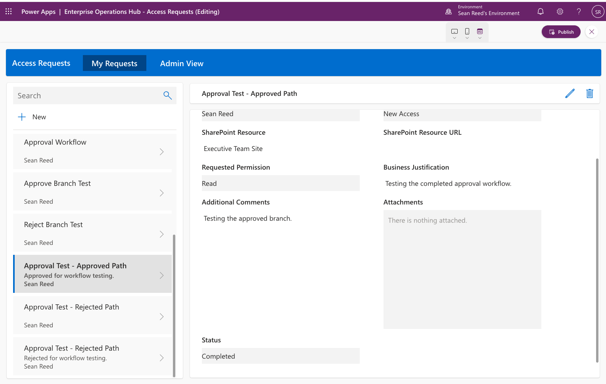
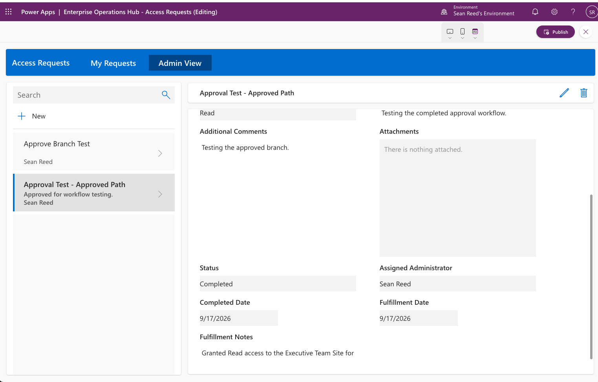
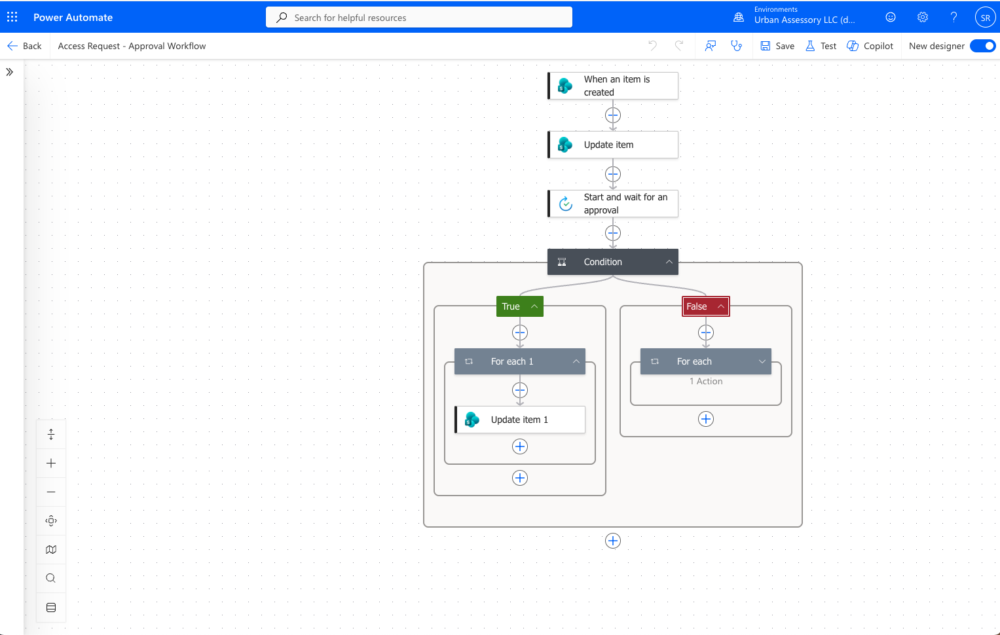
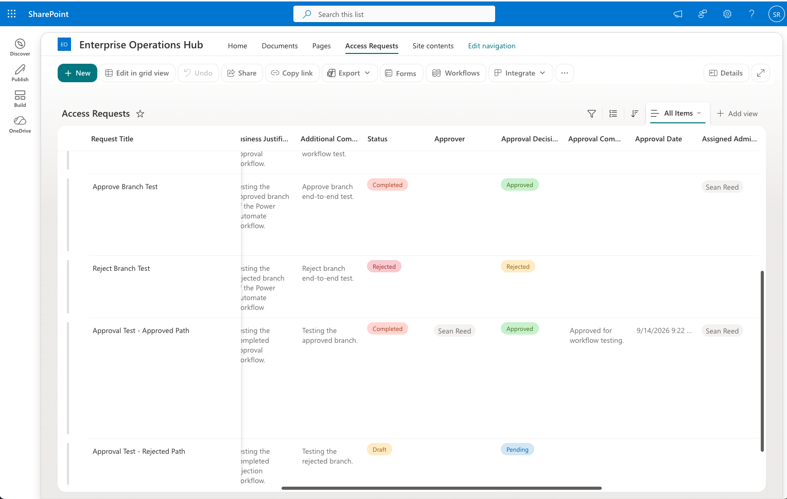

# Enterprise Operations Hub

An enterprise-style Microsoft 365 request-management solution built with **SharePoint Online, Power Apps, Power Automate, and Microsoft 365**.

The Enterprise Operations Hub demonstrates a complete SharePoint access-request lifecycle—from employee submission and approval through administrator fulfillment and completion.

> **V1 Status: Published and validated end-to-end**

## V1 Highlights

- Employee SharePoint access-request submission through Power Apps
- SharePoint Online request data and lifecycle tracking
- Automated Request ID generation
- Power Automate approval and rejection workflow
- Dedicated **My Requests** experience
- Role-aware **Admin View**
- Microsoft 365 group-based administrator detection
- Controlled `Approved → In Progress → Completed` fulfillment lifecycle
- Administrator assignment and fulfillment documentation
- SharePoint Person-field integration
- Published Power Apps application validated through live testing
- Project, architecture, requirements, and debugging documentation

## Project Objective

The Enterprise Operations Hub was created to demonstrate the progression from Microsoft 365 and SharePoint administration into Microsoft 365 and Power Platform development.

The solution is modeled around a fictional enterprise organization of approximately **3,500 employees** and applies real-world concepts including request management, approvals, role-aware experiences, fulfillment tracking, auditability, least privilege, and administrative separation of duties.

V1 focuses on a **SharePoint Access / Permission Change Request** process. Employees can submit and track requests, authorized approvers can approve or reject them, and administrators can document fulfillment through completion.

The project is designed to expand in later versions with additional Microsoft 365 automation, reporting, identity, security, and governance capabilities.

## V1 Business Process

The completed V1 workflow is:

```text
Employee
    ↓
Power Apps Request Interface
    ↓
SharePoint Online — Access Requests
    ↓
Power Automate
    ↓
Approval / Rejection
    ↓
Administrator Fulfillment
    ↓
Request Completion
```

V1 implements a complete **SharePoint Access / Permission Change Request** lifecycle.

### Request Lifecycle

1. An employee submits a SharePoint access request through Power Apps.
2. The request is stored in the SharePoint Online `Access Requests` list.
3. Power Automate generates a unique Request ID such as `AR-00008`.
4. The request is sent through an approval workflow.
5. The approval decision and related information are written back to SharePoint.
6. Approved requests become available for administrator fulfillment.
7. An administrator records assignment, fulfillment details, and fulfillment dates.
8. The request progresses through the controlled lifecycle:

   `Approved → In Progress → Completed`

9. The completed request remains in SharePoint as part of the request history and audit trail.

## Requester and Administrator Experiences

### My Requests

The employee-facing **My Requests** experience filters the request gallery for the currently signed-in user.

Employees can:

- Submit access requests
- View their own requests
- Search their request history
- Review request status
- View readable SharePoint Person-field information

Administrative fulfillment fields are hidden from the requester experience.

### Admin View

The **Admin View** provides the administrative fulfillment experience.

Administrator access within the application is determined using Microsoft 365 group membership. Authorized administrators can work with approved, in-progress, and completed requests and document the fulfillment process.

V1 intentionally separates:

**Approval = authorization**

from:

**Fulfillment = execution of the approved change**

This separation provides a clearer operational and audit trail between approving a request and recording that the administrative work was completed.

> **Security note:** Role-aware Power Apps controls improve the application experience but do not replace SharePoint data-layer permissions or enterprise authorization controls.

## Technology Stack

### Implemented in V1

#### Microsoft 365

- SharePoint Online
- Microsoft 365
- Microsoft 365 group-based role awareness

#### Power Platform

- Power Apps
- Power Automate

#### V1 Implementation

- SharePoint Online `Access Requests` list
- SharePoint Person fields
- Power Apps canvas application
- Power Fx formulas
- Power Automate approval workflow
- Automated Request ID generation
- Requester and administrator application modes
- Approval and fulfillment lifecycle tracking

### Planned Future Expansion

Future phases are intended to extend the project beyond the completed V1 implementation.

#### Microsoft 365, Identity, and Automation

- Microsoft Entra ID
- Microsoft Graph
- PowerShell
- PnP PowerShell

#### Power Platform and Reporting

- Dataverse
- Power BI
- Additional Power Automate workflows
- Expanded governance and lifecycle automation

#### Optional Application and Cloud Development

- C#
- ASP.NET Core Web API
- Microsoft Azure

Future technologies will be added to the project documentation as they are actually implemented and validated.

## Future Portal Expansion

The completed V1 focuses on the SharePoint access-request workflow and its Power Apps and Power Automate integration.

Future versions of the Enterprise Operations Hub may expand the broader SharePoint portal experience with:

- Home
- Submit Request
- My Requests
- Knowledge Base
- Policies
- Reports
- Administration

Future development is intended to explore additional enterprise concepts such as information architecture, permissions, metadata, navigation, reporting, governance, search, and lifecycle management.

These capabilities are part of the project roadmap and are not presented as completed V1 functionality.

## V1 Screenshots

The following screenshots demonstrate the completed Enterprise Operations Hub V1 workflow.

### Employee — My Requests

The **My Requests** experience allows the signed-in employee to review and search their own SharePoint access requests while keeping administrative fulfillment fields out of the requester experience.



### Administrator — Fulfillment View

The **Admin View** provides authorized administrators with the information needed to manage approved requests through fulfillment and completion.



### Power Automate — Approval Workflow

Power Automate manages the approval/rejection process and writes workflow results back to the SharePoint request record.



### SharePoint — Request and Workflow Records

SharePoint Online provides the underlying request data, workflow status, approval information, and fulfillment history.



## Repository Structure

```text
Enterprise-Operations-Hub/
├── docs/
│   ├── architecture/
│   ├── requirements/
│   ├── sharepoint/
│   ├── power-apps/
│   ├── power-automate/
│   ├── dataverse/
│   ├── power-bi/
│   ├── powershell/
│   ├── graph/
│   ├── governance/
│   ├── testing/
│   └── environment-setup.md
├── screenshots/
├── scripts/
│   ├── powershell/
│   └── graph/
├── DEBUGGING_JOURNAL.md
├── PROJECT_JOURNAL.md
├── README.md
└── .gitignore
```
